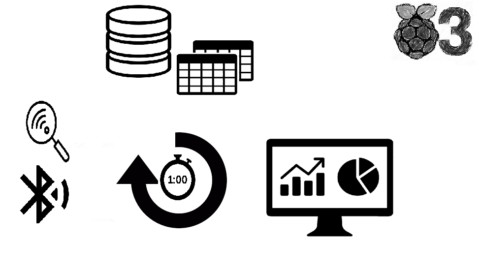

# Wi-Fi-and-Bluetooth-Tracking-rspb

This project is about analyzing network activity for both Wi-Fi and Bluetooth in order to determine how people use the place. 
The image below describes the way the project works. Every minute a Bluetooth and Wi-Fi scans are done, the results are stored in two different tables in a database and then printed on a dash application. Everything is done using a Raspberry Pi 3B+.

--------------
## Interface
The application is developped with Dash for Python (photo below).

1. Title of the tab : During a scan the tab displays "Scanning" else it displays "Wi-Fi and Bluetooth Tracking"
2. and 3.  Details of the project : link to this GitHub
4. People currently around : latest scan results (for both)
5. Ratio : people who we could be missing during our scans because either they don't have a smartphone or because they don't have Bluetooth or Wi-Fi on.
6. Total people : number of users found in the database
7. Average time spent :  When a user is detected we add plus one to a value which means he spent one minute at the place. Then the average is calculated for each user we have found. 
8. Reset button for the time.
9. Data state : The results of the scans can be saved to a .txt file and the time is displayed here. 
10. Button to save the data.
11. Overall detection type graph.
12. Scatter plot of the results of the scans, the total results and the ratio results.

---------------
## Database 

### Wi-Fi table 

### Bluetooth table 

----------------
## Scans
### Wi-Fi scan 
### Bluetooth scan
