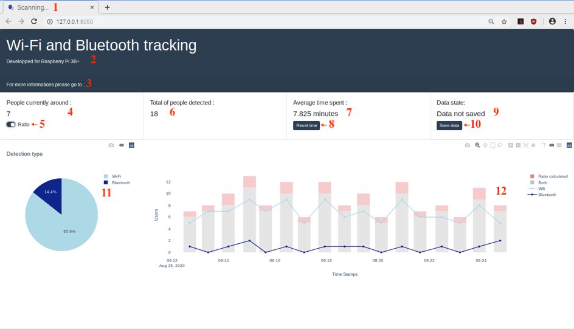
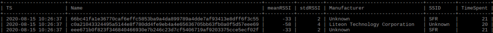
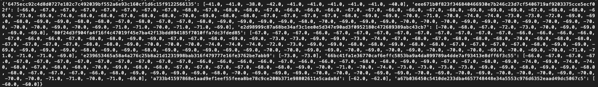
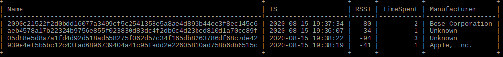

# Wi-Fi-and-Bluetooth-Tracking-rspb

This project is about analyzing network activity for both Wi-Fi and Bluetooth in order to determine how people use the place. 
The image below describes the way the project works. Every minute a Bluetooth and Wi-Fi scans are done, the results are stored in two different tables in a database and then printed on a dash application. Everything is done using a Raspberry Pi 3B+.

--------------
## Interface
The application is developped with Dash for Python (photo below).

1. Title of the tab : During a scan the tab displays "Scanning" else it displays "Wi-Fi and Bluetooth Tracking"
2. and 3.  Details of the project : link to this GitHub
4. People currently around : latest scan results (for both)
5. Ratio : people who we could be missing during our scans because either they don't have a smartphone or because they don't have Bluetooth or Wi-Fi on.
6. Total people : number of users found in the database
7. Average time spent :  When a user is detected we add plus one to a value which means he spent one minute at the place. Then the average is calculated for each user we have found. 
8. Reset button for the time.
9. Data state : The results of the scans can be saved to a .txt file and the time is displayed here. 
10. Button to save the data.
11. Overall detection type graph.
12. Scatter plot of the results of the scans, the total results and the ratio results.

---------------
## Database 
There's one database that contains two tables, one for the results of the Wi-Fi and the other for the Bluetooth.

### Wi-Fi table 

For the Wi-Fi we are storing the timestamp, the hash and coded mac address source, the mean RSSI, the standard deviation of the RSSI, the manufacturer, the SSID and the time spent value.
The manufacturer is obtained from the oui identifier. 

During a scan, everytime an user is detected the RSSI detected with it is added to a list (unique for each user) and then at the end of the scan we calculate the mean and the standard deviation. See the photo below. 

### Bluetooth table 

For the Bluetooth we are storing the timestamp, the hash and coded mac address source, the RSSI, the manufacturer and the time spent value.

----------------
## Scans
### Wi-Fi scan 

Each Wi-Fi scan lasts 10 seconds and is done using a Tshark command every minute. The results are then treated and added to the database if it's a new user else it's updated.
For the Raspberry Pi to do such, it has to have the monitor mode (iw phy phy0 info) if it doesn't you can [patch the firmware to have it.](https://pimylifeup.com/raspberry-pi-nexmon/)

### Bluetooth scan

Each Bluetooth scan lasts 10 seconds and is done using Bluetoothctl every minute. The results are treated the same way as for the Wi-Fi. 
