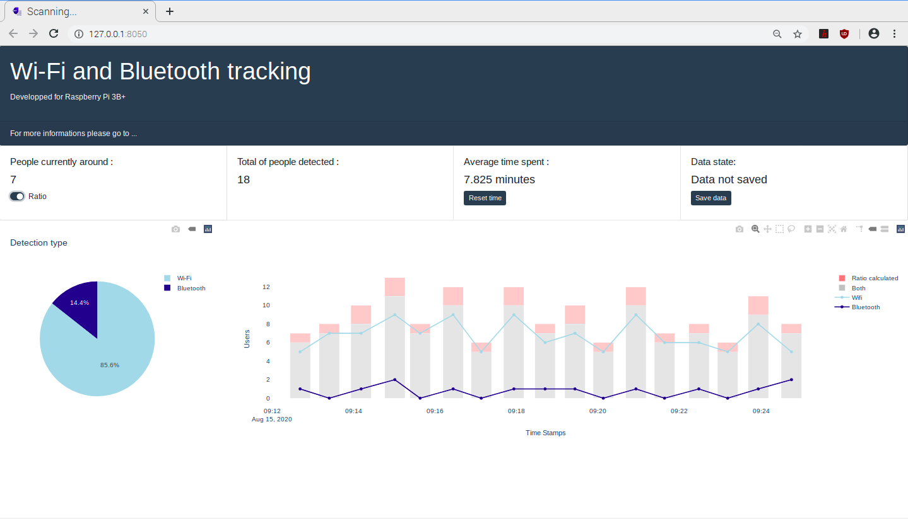

# Wi-Fi-and-Bluetooth-Tracking-rspb

This project is about analyzing network activity for both Wi-Fi and Bluetooth in order to determine how people use the place. 
The application is developped with Dash for Python (photo below) and is on a Raspberry Pi 3B+.

